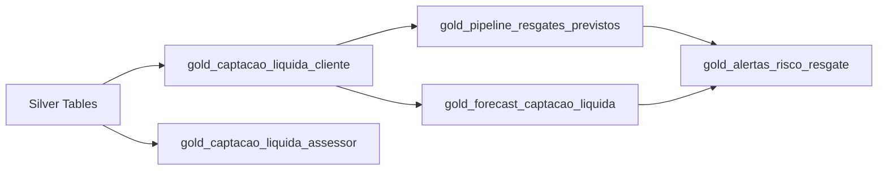

# 📊 Tabelas Gold - Captação Líquida

Este diretório contém as definições das tabelas Gold relacionadas à captação líquida, projetadas para suportar análises avançadas, dashboards executivos, modelos de IA/ML e tomada de decisão estratégica na M7 Investimentos.

## 📋 Índice de Tabelas

1. [gold_captacao_liquida_cliente](#1-gold_captacao_liquida_cliente)
2. [gold_captacao_liquida_assessor](#2-gold_captacao_liquida_assessor)
3. [gold_pipeline_resgates_previstos](#3-gold_pipeline_resgates_previstos)
4. [gold_forecast_captacao_liquida](#4-gold_forecast_captacao_liquida)
5. [gold_alertas_risco_resgate](#5-gold_alertas_risco_resgate)

## 🎯 Visão Geral

As tabelas Gold foram projetadas seguindo as melhores práticas de Data Warehousing:

- **Grain definido**: Cada tabela tem um nível de granularidade claro
- **Desnormalização otimizada**: Para performance em queries analíticas
- **Métricas pré-calculadas**: Reduzindo processamento em tempo de consulta
- **Particionamento**: Por data para otimizar queries temporais
- **Índices estratégicos**: Para os padrões de consulta mais comuns

## 📊 Detalhamento das Tabelas

### 1. gold_captacao_liquida_cliente

**Propósito**: Visão 360° do cliente com todas as métricas relevantes para análise de captação líquida.

**Grain**: Cliente × Mês

**Principais Categorias de Métricas**:
- 📈 Captação e Resgate (bruta, líquida, por produto)
- 💰 Patrimônio e Rentabilidade
- 🎯 Comportamento e Engajamento
- 📊 CRM e Oportunidades
- 😊 Satisfação (NPS)
- ⚠️ Risco e Churn
- 🤖 Features para ML
- 📊 Comparativos e Benchmarks

**Casos de Uso**:
- Dashboards de performance por cliente
- Segmentação e clustering
- Modelos preditivos de churn
- Análise de lifetime value
- Personalização de ofertas

### 2. gold_captacao_liquida_assessor

**Propósito**: Performance comercial consolidada dos assessores para gestão, comissionamento e desenvolvimento.

**Grain**: Assessor × Mês

**Principais Categorias de Métricas**:
- 👥 Carteira de clientes
- 💼 Captação e AUM
- 📈 Produtividade e eficiência
- 🎯 Pipeline e conversão
- 🏆 Rankings e comparativos
- 💵 Comissionamento
- 📚 Desenvolvimento e capacitação

**Casos de Uso**:
- Rankings de performance
- Cálculo de comissões
- Identificação de best practices
- Planejamento de capacitação
- Análise de produtividade

### 3. gold_pipeline_resgates_previstos

**Propósito**: "CRM Reverso" para prever e prevenir resgates antes que aconteçam.

**Grain**: Cliente × Data de Previsão

**Principais Funcionalidades**:
- 🔮 Previsões probabilísticas de resgate
- 🎯 Classificação de risco (Iminente/Alto/Médio/Baixo)
- 📋 Ações recomendadas personalizadas
- 📞 Tracking de contatos e resultados
- 📊 Métricas de eficácia

**Casos de Uso**:
- Campanhas de retenção proativas
- Priorização de contatos
- Scripts de abordagem
- Análise de eficácia de ações

### 4. gold_forecast_captacao_liquida

**Propósito**: Consolidar previsões integradas de captação e resgate com cenários.

**Grain**: Cliente × Período de Forecast

**Principais Funcionalidades**:
- 📈 Forecast de captação (via CRM)
- 📉 Forecast de resgate (via ML)
- 🎯 Captação líquida prevista
- 📊 Cenários (otimista/realista/pessimista)
- ✅ Validação e accuracy

**Casos de Uso**:
- Planejamento de metas
- Alocação de recursos
- Análise de cenários
- Monitoramento de accuracy

### 5. gold_alertas_risco_resgate

**Propósito**: Sistema operacional de alertas para ação imediata.

**Grain**: Cliente × Alerta

**Principais Funcionalidades**:
- 🚨 Alertas em tempo real
- 🎯 Priorização automática
- 📋 Workflow de gestão
- 📊 Tracking de resultados
- 📈 Análise de eficácia

**Casos de Uso**:
- Notificações para assessores
- Gestão de alertas críticos
- Acompanhamento de SLAs
- Melhoria contínua

## 🔄 Fluxo de Dados



## 🚀 Implementação Recomendada

### Fase 1: Foundation (Semanas 1-2)
- [ ] Implementar `gold_captacao_liquida_cliente`
- [ ] Criar ETL inicial com métricas básicas
- [ ] Validar qualidade dos dados

### Fase 2: Analytics (Semanas 3-4)
- [ ] Implementar `gold_captacao_liquida_assessor`
- [ ] Criar dashboards iniciais
- [ ] Treinar equipe em consultas

### Fase 3: Predictive (Semanas 5-6)
- [ ] Implementar `gold_pipeline_resgates_previstos`
- [ ] Implementar `gold_forecast_captacao_liquida`
- [ ] Desenvolver modelos preditivos

### Fase 4: Operational (Semanas 7-8)
- [ ] Implementar `gold_alertas_risco_resgate`
- [ ] Integrar com sistemas de notificação
- [ ] Criar workflows operacionais

## 📝 Queries de Exemplo

### Top 10 Clientes por Captação Líquida

```sql
SELECT 
    cliente_nome,
    cliente_segmento,
    assessor_nome,
    captacao_liquida_mes,
    captacao_liquida_12m,
    patrimonio_atual
FROM gold_captacao_liquida_cliente
WHERE data_referencia = LAST_DAY(CURRENT_DATE - INTERVAL 1 MONTH)
ORDER BY captacao_liquida_mes DESC
LIMIT 10;
```

### Assessores com Maior Risco de Perda de AUM

```sql
SELECT 
    a.assessor_nome,
    a.aum_total,
    COUNT(DISTINCT p.cliente_id) as qtd_clientes_risco,
    SUM(p.valor_provavel_resgate_30d) as valor_risco_total
FROM gold_captacao_liquida_assessor a
JOIN gold_pipeline_resgates_previstos p ON a.assessor_id = p.assessor_id
WHERE p.categoria_risco IN ('IMINENTE', 'ALTO')
    AND p.status_previsao = 'ATIVA'
GROUP BY a.assessor_id, a.assessor_nome, a.aum_total
ORDER BY valor_risco_total DESC;
```

### Accuracy do Forecast

```sql
SELECT 
    periodo_forecast,
    AVG(ABS(erro_percentual_30d)) as mape_30d,
    AVG(ABS(erro_percentual_90d)) as mape_90d,
    COUNT(*) as qtd_forecasts
FROM gold_forecast_captacao_liquida
WHERE captacao_liquida_realizada_30d IS NOT NULL
GROUP BY periodo_forecast;
```

## 🔧 Manutenção

### Checklist Diário
- [ ] Verificar carga das tabelas
- [ ] Monitorar alertas críticos
- [ ] Validar accuracy dos modelos

### Checklist Semanal
- [ ] Analisar eficácia das ações
- [ ] Revisar rankings
- [ ] Atualizar forecasts

### Checklist Mensal
- [ ] Recalibrar modelos
- [ ] Revisar métricas
- [ ] Gerar relatórios executivos

## 📞 Suporte

**Time de Data & Analytics**
- Email: data@m7investimentos.com.br
- Slack: #data-warehouse

**Documentação Adicional**
- [Dicionário de Dados](../../../docs/dicionario_dados.md)
- [Guia de SQL](../../../docs/guia_sql.md)
- [FAQ](../../../docs/faq.md)

---

*Última atualização: Janeiro 2025*
